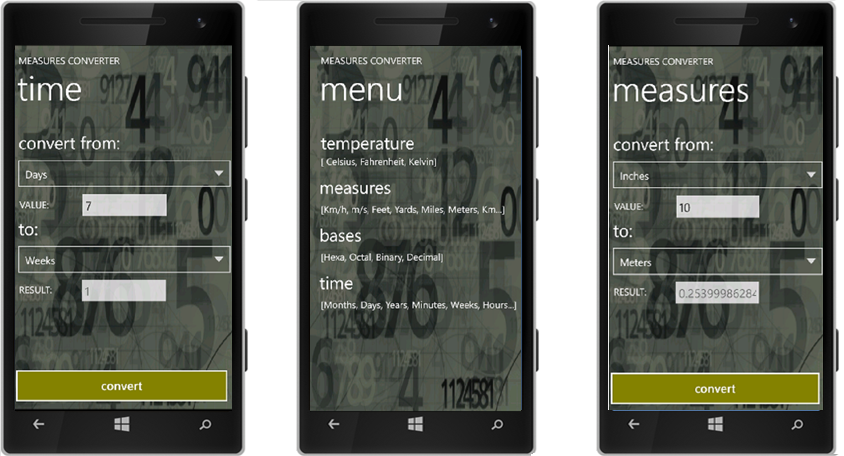

# Conversor Phone - Measures Converter :iphone:

ConversorPhone (or Measures Converter) is a Windows Phone 7/7.5 app developed by Cassia Almeida to be presented as the final project for the Windows Phone Developers Course made in 2011.
This app Was published in Windows Store and enabled the user to convert several measures types, such as:
* Km/h to m/s
* Feet
* Yards
* Inches
* Temperature (Celsius, Fahrenheit, Kelvin)
* Decimal to Binary, Octal, Hexa  
* Time (hours to minutes, seconds, years, days...)

## Project Structure

There's a different xaml page for each conversion selected by the user:
* BasesPage.xaml
* MassaPage.xaml (weights)
* MedidasPage.xaml (measures)
* TemperaturaPage.xaml (temperatures: Celsius, Fahrenheit, Kelvin)
* TempoPage.xaml (time: hours to minutes, seconds, years, days...)
* VelocidadePage.xaml (Km/h to m/s)
* Page2.xaml - responsible for populating the elements combo boxes with the conversion options, and responsible for calling the correct converter depending on what the user choose to convert:

```c#
/// <summary>
/// Renderiza a página com o tipo de conversão solicitado
/// </summary>
private void RenderizaComponentes()
{
    var thisApp = App.Current as App;
    var conversao = (ConversoesEnum)Enum.Parse(typeof(ConversoesEnum), thisApp.TypeConvertion, true);
    switch (conversao)
    {
        case ConversoesEnum.BASES:
            this.listaCombo = ConversaoBases.LoadBases();
            break;
        case ConversoesEnum.MEDIDAS:
            this.listaCombo = ConversaoMedidas.LoadMedidas();
            break;
        case ConversoesEnum.TEMPERATURA:
            this.listaCombo = ConversaoTemperatura.LoadTemperatura();
            this.PageTitle.Text = "temperature";
            break;
        case ConversoesEnum.TEMPO:
            this.listaCombo = ConversaoTempo.LoadTempo();
            this.PageTitle.Text = "time";
            break;
        case ConversoesEnum.MASSA:
            this.listaCombo = ConversaoMassa.LoadMassa();
            this.PageTitle.Text = "weight";
            break;
        case ConversoesEnum.VELOCIDADE:
            this.listaCombo = ConversaoVelocidade.LoadVelocidade();
            this.PageTitle.Text = "speed";
            break;
    }
    this.comboBoxDe.ItemsSource = listaCombo;
    this.comboBoxPara.ItemsSource = listaCombo;
    this.comboBoxDe.SelectedIndex = 0;
    this.comboBoxPara.SelectedIndex = 0;
}
```

Converter Click event:

```c#
 private void Converter_Click(object sender, RoutedEventArgs e)
{
    textBlockErro.Visibility = Visibility.Collapsed;
    int de = comboBoxDe.SelectedIndex;
    int para = comboBoxPara.SelectedIndex;

    try
    {
        switch (MainPage.conversao)
        {
            //Conversão de Bases
            #region Bases
            case (ConversoesEnum.BASES):
                ConversaoBases.Converte(de, para, textBoxQuantidade.Text);
                break;
            #endregion
            
            //Conversão de Tempo
            #region Tempo
            case (ConversoesEnum.TEMPO):

                try
                {
                    double valorEntrada = Double.Parse(textBoxQuantidade.Text);
                    double resultado = 0.0;
                    switch (de)
                    {
                        //Anos
                        case (1):
                            resultado = caculaDias(para, valorEntrada * 365);
                            break;

                        //Dias
                        case (2):
                            resultado = caculaDias(para, valorEntrada);
                            break;

                        //Horas
                        case (3):
                            resultado = caculaDias(para, valorEntrada / 24);
                            break;

                        //Mês
                        case (4):
                            resultado = caculaDias(para, valorEntrada * 30);
                            break;

                        //Minutos
                        case (5):
                            resultado = caculaDias(para, ((valorEntrada / 24) / 60));
                            break;

                        //Segundos
                            case (6):
                                resultado = caculaDias(para, (valorEntrada / 86400));
                                break;

                            //Semanas
                            case (7):
                                resultado = caculaDias(para, valorEntrada / 7);
                                break;
                        }

                        textBoxResultado.Text = resultado.ToString();
                    }
            
            .
            .
            .
            
        }
     }
}
```

## Project Deployment

The application was published in US, BR and PT markets, reaching thousands of users. For US, a translated version was deployed.
After Windows Phone version 8.1, Microsoft unfortunately removed all apps from the store that were compatible only with versions 7 or 7.5 (in this case, THIS APP! :sob:).

## Screenshots
  

