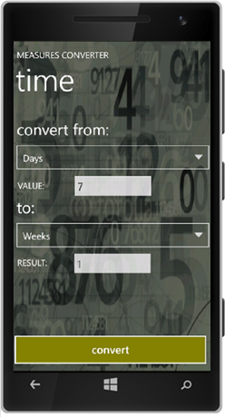

<h1>ConversorPhone - Measures Converter</h1>

ConversorPhone (or Measures Converter) is a Windows Phone 7/7.5 app developed by Cassia Almeida to be presented as the final project for the Windows Phone Developers Course made in 2011.

This app is published in Windows Store and enables the user to convert several measures types, such as:

<ul>
  <li>Km/h to m/s</li>
  <li>Feet</li>
  <li>Yard</li>
  <li>Inches</li>
  <li>Temperature (Celsius, Fahrenheit, Kelvin)</li>
  <li>Decimal to Binary, Octal, Hexa</li>
  <li>Time (hours to minutes, seconds, years, days...)</li>
</ul>

  
    
  
    
  

